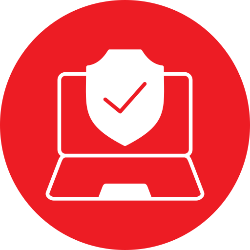

# Privacy Protector

<div align="center">
  
</div>


**Privacy Protector** é uma poderosa extensão de navegador projetada para analisar e aprimorar sua privacidade online. Ela escaneia páginas da web em busca de diversas ameaças à privacidade, fornece relatórios detalhados sobre riscos potenciais e oferece insights acionáveis para ajudar você a manter um nível mais alto de privacidade enquanto navega.

## Índice

- [Recursos](#recursos)
- [Instalação](#instalação)
  - [Pré-requisitos](#pré-requisitos)
  - [Clonando o Repositório](#clonando-o-repositório)
  - [Instalando no Firefox](#instalando-no-firefox)
- [Uso](#uso)

## Recursos

O **Privacy Protector** realiza varreduras abrangentes de páginas da web para detectar e avaliar várias ameaças à privacidade. Veja o que ele pode fazer:

- **Detectar Domínios de Terceiros:** Identifica se um site está usando domínios de terceiros para anúncios, rastreamento ou outros propósitos.
- **Identificar Ameaças de Sequestro:** Verifica se o site está embutido dentro de um iframe, o que pode indicar potenciais ameaças de sequestro ou hooking.
- **Analisar Uso de Armazenamento Local:** Detecta se o site está armazenando dados no `localStorage` do navegador, o que pode ser usado para rastreamento.
- **Detectar Canvas Fingerprinting:** Identifica se o site está usando técnicas de canvas fingerprinting para criar identificadores únicos de usuário.
- **Monitorar Cookies:** Avalia o uso de cookies de primeira e terceira partes, incluindo a quantidade total de cookies configurados pelo site.
- **Relatórios Detalhados:** Fornece uma pontuação de privacidade clara e concisa de 100 pontos, juntamente com deduções detalhadas explicando onde e por que pontos foram perdidos.

### Detalhamento da Pontuação de Privacidade

| **Risco**                          | **Dedução de Pontos**                    | **Descrição**                                                                                                   |
|------------------------------------|------------------------------------------|-----------------------------------------------------------------------------------------------------------------|
| **Domínios de Terceiros**          | 15 pontos                                | Dedução se o site usar domínios de terceiros para anúncios ou rastreamento, permitindo coleta de informações do usuário. |
| **Ameaças de Sequestro/Hooking**   | 20 pontos                                | Dedução se o site estiver embutido em um iframe, indicando possíveis riscos de sequestro de navegador ou injeção de scripts maliciosos. |
| **Uso de Armazenamento Local**     | 15 pontos                                | Dedução se o site armazenar dados no `localStorage`, que podem conter informações sensíveis e serem usados para rastreamento. |
| **Canvas Fingerprinting**          | 10 pontos                                | Dedução se o site utilizar canvas fingerprinting, técnica que cria um identificador único com base na renderização gráfica do navegador. |
| **Cookies de Terceiros**           | 15 pontos                                | Dedução se o site configurar cookies de terceiros, frequentemente usados para rastreamento entre diferentes sites. |
| **Quantidade de Cookies**          | 10 pontos                                | Dedução se o total de cookies (primeira e terceira parte) exceder 10, indicando práticas intensivas de rastreamento. |
| **Excesso de Cookies de Terceiros**| 2 pontos por cookie acima de 5           | Dedução adicional de pontos por cada cookie de terceiros acima de 5, aumentando com a quantidade excessiva.         |

**Nota:** Algumas deduções podem ser acumulativas, dependendo do número de cookies de terceiros presentes.

## Instalação

### Pré-requisitos

- **Git:** Certifique-se de ter o Git instalado em sua máquina. Você pode baixá-lo [aqui](https://git-scm.com/downloads).
- **Navegador Firefox:** O Privacy Protector é compatível com o Firefox. Baixe-o [aqui](https://www.mozilla.org/firefox/new/).

### Clonando o Repositório

1. **Abra o Terminal (macOS/Linux) ou Prompt de Comando (Windows):**

2. **Clone o Repositório:**

   ```bash
   git clone https://github.com/LuccaHiratsuca/privacy-protector.git
    ```

3. Navegue até o Diretório do Projeto:

   ```bash 
   cd privacy-protector
    ```
### Instalando no Firefox

Para instalar o Privacy Protector no Firefox para fins de desenvolvimento e teste, siga estas etapas:

1. **Abra o Firefox:**

2. **Acesse a Página de Depuração de Extensões:**

   - Digite `about:debugging` na barra de endereços do Firefox e pressione `Enter`.

3. **Habilite a Depuração de Extensões:**

    - Clique em "Esta versão do Firefox" na barra lateral.
    - Ative a opção "Habilitar a depuração de extensões" se ainda não estiver ativada.

4. **Carregue a Extensão Temporária:**

    - Clique no botão "Carregar Extensão Temporária...".
    - Navegue até o diretório do repositório clonado e selecione o arquivo `manifest.json` localizado na raiz ou na subpasta especificada (por exemplo, `src`).

5. **Verifique a Instalação:**

    - Uma vez carregada, a extensão Privacy Protector deve aparecer na lista de extensões.
    - Agora você pode usar a extensão para realizar varreduras de privacidade em qualquer site.

Nota: Este método carrega a extensão temporariamente. Para manter a extensão instalada permanentemente, considere empacotá-la e submetê-la à `Mozilla Add-ons`.

## Uso

1. **Ative a Extensão:**

   - Clique no ícone do Privacy Protector na barra de ferramentas do Firefox.

2. **Execute uma Varredura de Privacidade:**

    - Clique no botão "Executar Verificação".
    - A extensão começará a analisar a página da web atual em busca de várias ameaças à privacidade.

3. **Visualize os Resultados:**

    - Após a varredura, um relatório detalhado será exibido, mostrando a pontuação de privacidade e deduções para cada risco detectado.
    - Clique em "Ver Detalhes" em qualquer seção para ver mais informações sobre as ameaças específicas detectadas.

4. **Entenda a Pontuação de Privacidade:**

    - Clique no botão "Pontuação" localizado no canto superior direito do relatório para acessar uma explicação abrangente de como a pontuação de privacidade é calculada e o que cada dedução significa.
    - Use essas informações para entender melhor os riscos à privacidade e tomar medidas para mitigá-los.
